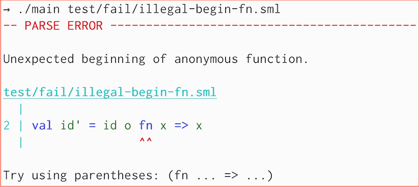
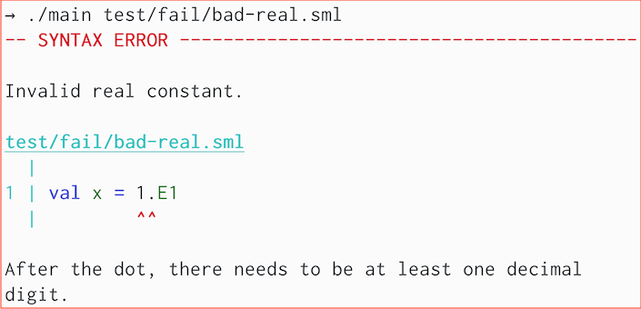

# `smlfmt`

A custom parser and code formatter for Standard ML. `smlfmt` is fast,
configurable, and usable for large projects.

All of the SML code in this repository (everything in
`src`) has been formatted by `smlfmt`. Take a look!

**(Jan 10, 2023)** Released v1.0.0!

**(Dec 29, 2022)** changed repository name to `smlfmt` (used to be `parse-sml`).

## Features
- Full support for Standard ML according to the formal definition.
- Fast -- see performance results below.
- Usable for large projects.
    * Whole-project formatting via `.mlb` files using
      [MLton](https://github.com/MLton/mlton) conventions,
      including [MLBasis path maps](http://mlton.org/MLBasisPathMap).
- Helpful error messages with visual code references and syntax highlighting.
- Support for various SuccessorML syntax extensions.
- Configurable indentation size and maximum width.
- Emacs integration (see [smlfmt.el](https://github.com/diku-dk/smlfmt.el))

## Performance
`smlfmt` is fast enough for live reformatting on large individual files, and can reformat large projects in seconds.

Here are measurements for `smlfmt --preview-only INPUT > out` on my MacBook Air (M2, 2022).
Input | Size (LoC) | Time
-|-|-
[`src/prettier-print/PrettierExpAndDec.sml`](https://github.com/shwestrick/smlfmt/blob/main/src/prettier-print/PrettierExpAndDec.sml) | 1024 | 31 ms
[`src/base/PrettyTabbedDoc.sml`](https://github.com/shwestrick/smlfmt/blob/main/src/base/PrettyTabbedDoc.sml) | 1349 | 29 ms
[`src/parse/ParseExpAndDec.sml`](https://github.com/shwestrick/smlfmt/blob/main/src/parse/ParseExpAndDec.sml) | 1363 | 28 ms
MLton [`elaborate-core.fun`](https://github.com/MLton/mlton/blob/master/mlton/elaborate/elaborate-core.fun) | 3942 | 104 ms
MLton [`x86-allocate-registers.fun`](https://github.com/MLton/mlton/blob/master/mlton/codegen/x86-codegen/x86-allocate-registers.fun) | 11034 | 216 ms
Entire `smlfmt` source code ([`smlfmt.mlb`](https://github.com/shwestrick/smlfmt/blob/main/src/smlfmt.mlb)) | 20000 (approx.) | 305 ms
Entire MLton source code ([`mlton.mlb`](https://github.com/MLton/mlton/blob/master/mlton/mlton.mlb)) | 160000 (approx.) | 6.6s

(Timings are averages reported by [`hyperfine`](https://github.com/sharkdp/hyperfine).)

## Examples: Error Messages





## Build and run

You need [`mlton`](http://mlton.org/) installed.

Do `make` and then pass a `.sml` file, for example:
```bash
$ make
$ ./smlfmt --preview src/smlfmt.sml
```

You can pass a `.mlb` file to format all files in a project. Use `--force`
to skip overwrite confirmations.
```bash
$ ./smlfmt --force src/smlfmt.mlb
```

Additionally, code can be passed directly through `stdin` and `stdout`.
```bash
$ echo "val x = 5 val y = 6" | ./smlfmt
```

### Command-line options

`--force` skips interactive overwrite confirmations.

`--preview` also prints any formatted code to stdout,
with syntax highlighting (if shown on terminal supporting ANSI colors).

`--preview-only` is the same as `--preview`, but also skips writing to file.
(This is incompatible with `--force`.)

`--read-only` will only parse files (and report syntax errors). No interactive
confirmation, and no files will be modified.
(This is incompatible with `--force`.)

`--check` will verify that files are already formatted (for example, for CI).
No interactive confirmation, and no files will be modified.
(This is incompatible with `--force`.)

`-mlb-path-var '<key> <value>'` for handling path variables, similar to
[MLton's path maps](http://mlton.org/MLBasisPathMap).

`-ribbon-frac <real>` (default 1.0) controls pretty-printing. The
ribbon-frac (between 0 and 1) controls how dense each line is, excluding
indentation. Low ribbon-fracs will have very little non-whitespace content
on each line, whereas high ribbon-fracs will attempt to fill the line as
much as possible. Default = 1.0

`-max-width <int>` (default 80) controls pretty-printing.
This is the desired maximum number of columns in each line.
Note that it is not always possible to ensure that the output is within
the max width. (For example, deeply nested `let...in...end` expressions
will always indent further, and long comments/strings are not broken up.)

`-indent-width <int>` (default 2) is the desired number of spaces used in
the formatted output.

`-tab-width <int>` (default 4) informs the pretty-printer of the intended
tab-width for the input source. Typically this doesn't matter, but there are
some cases where a particular tab-width can influence the vertical alignment
of multiline comments and strings. (See discussion in issue #28 for more
details.)

`-engine [pretty|prettier]` (default `prettier`) selects which pretty printing
engine to use. The `prettier` engine is the newest version. The `pretty`
engine is the old version.

`--debug-engine` enables debugging output, for developers. This flag requires
that the `--preview-only` flag is also enabled.

`-allow-top-level-exps [true|false]` (default `true`) controls whether or
not top-level expressions (terminated by a semicolon) are allowed.

`-allow-opt-bar [true|false]` (default `false`) controls whether or not
SuccessorML optional bar syntax is allowed.

`-allow-record-pun-exps [true|false]` (default `false`) controls whether or not
SuccessorML record punning syntax is allowed.

`-allow-or-pats [true|false]` (default `false`) controls whether or not
SuccessorML or-pattern syntax is allowed.

`-allow-extended-text-consts [true|false]` (default `false`) controls whether
or not SuccessorML extended text constants are allowed. Enable this to allow
for UTF-8 characters within strings.
