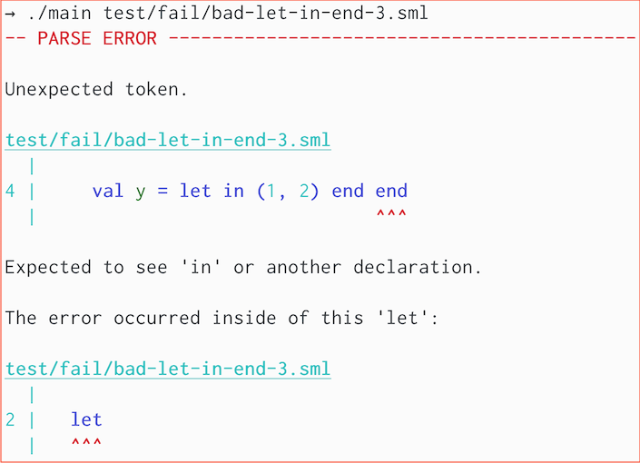

# `smlfmt`

A custom parser and code formatter for Standard ML, with
helpful error messages.

Supports SML source files
(`.sml`, `.sig`, `.fun`, etc.) as well as
[MLBasis](http://mlton.org/MLBasis) compilation files (`.mlb`) using
[MLton](https://github.com/MLton/mlton) conventions,
including [MLBasis path maps](http://mlton.org/MLBasisPathMap).

Most of the SML code in this repository (everything in `src`, except `src/lib`)
has been formatted by `smlfmt`. Take a look!

**Note (Dec 29, 2022)**: changed repository name to `smlfmt` (used to be `parse-sml`).

## Examples: Error Messages





## Examples: Code Formatting

The formatter generally handles blank lines and multiline comments in a
reasonable way:

Input:
```sml
fun fib n = (* everyone loves
             * fibonacci numbers *)
    if n < 2 then n
 else fib (n-1)
  + fib (n-2)

val f5 = fib 5
val f10 =
  fib 10
val f15 = fib 15
```

Output:
```sml
fun fib n =
  (* everyone loves
   * fibonacci numbers *)
  if n < 2 then
    n
  else
    fib (n - 1) + fib (n - 2)

val f5 = fib 5
val f10 = fib 10
val f15 = fib 15
```

## Build and run

You need [`mlton`](http://mlton.org/) installed.

Do `make` and then pass either a `.sml` file or a `.mlb` file, for example:
```bash
$ make
$ ./smlfmt --preview src/smlfmt.sml
```

### Command-line options

`--force` skips overwrite confirmations.

`--preview` also prints any formatted code to stdout,
with syntax highlighting (if shown on terminal supporting ANSI colors).

`--preview-only` is the same as `--preview`, but also skips writing to file.
(This is incompatible with `--force`.)

`-mlb-path-var '<key> <value>'` for handling path variables, similar to
[MLton's path maps](http://mlton.org/MLBasisPathMap).

`-ribbon-frac <real>` (default 1.0) controls pretty-printing. The
ribbon-frac (between 0 and 1) controls how dense each line is, excluding
indentation. Low ribbon-fracs will have very little non-whitespace content
on each line, whereas high ribbon-fracs will attempt to fill the line as
much as possible. Default = 1.0

`-max-width <int>` (default 80) controls pretty-printing.
This is the desired maximum number of columns in each line.
Note that it is not always possible to ensure that the output is within
the max width. (For example, deeply nested `let...in...end` expressions
will always indent further, and long comments/strings are not broken up.)

`-indent-width <int>` (default 2) is the desired number of spaces used in
the formatted output.

`-tab-width <int>` (default 4) informs the pretty-printer of the intended
tab-width for the input source. Typically this doesn't matter, but there are
some cases where a particular tab-width can influence the vertical alignment
of multiline comments and strings. (See discussion in issue #28 for more
details.)

`-engine [pretty|prettier]` (default `prettier`) selects which pretty printing
engine to use. The `prettier` engine is the newest version. The `pretty`
engine is the old version.

`--debug-engine` enables debugging output, for developers. This flag requires
that the `--preview-only` flag is also enabled.

`-allow-top-level-exps [true|false]` (default `true`) controls whether or
not top-level expressions (terminated by a semicolon) are allowed.

`-allow-opt-bar [true|false]` (default `false`) controls whether or not
SuccessorML optional bar syntax is allowed.

`-allow-record-pun-exps [true|false]` (default `false`) controls whether or not
SuccessorML record punning syntax is allowed.